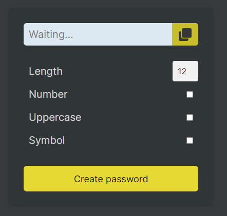
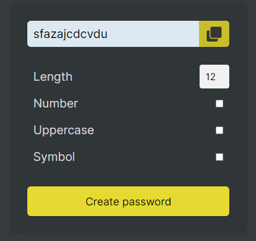
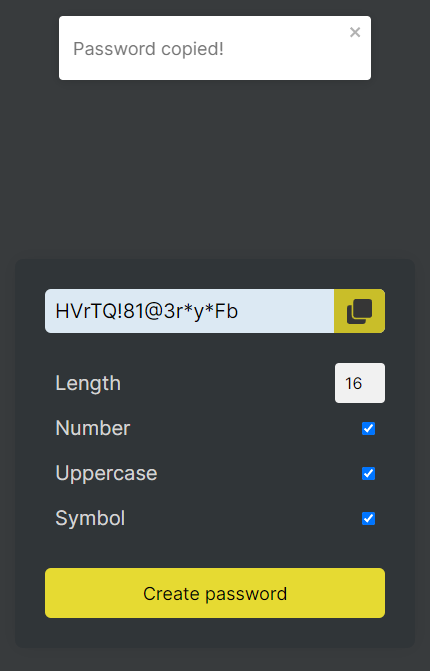

# Password Generator

A simple password generator built with React and JavaScript that works like a VR train's toilet. Also provided automated tests using Robot framework.

// sorry about using Finnish and English in the commits, I forgor I was ment to use only english :(

## Demo





## Table of Contents

- [Installation](#installation)
- [Usage](#usage)
- [Features](#features)
- [Technologies Used](#technologies-used)
- [Contributing](#contributing)
- [License](#license)
- [Contact Information](#contact-information)

## Installation

1. Clone the repository:

   ```bash
   git clone https://github.com/jmzii/passw-generator.git

   ```

2. Navigate to the project directory:

   ```bash
   cd password-generator

   ```

3. Install dependencies:

   ```bash
   npm install

   ```

4. Fire up the application:

   ```bash
   npm run dev

   ```

## Usage

1. Open the application in your web browser
2. Adjust the password criteria
3. Click the "Create password" button to generate a password
4. Click the copy icon to copy the generated password to the clipboard
5. A notification will appear confirming that the password has been copied

## Features

- Generate secure and randomized passwords with customizable criteria
- Option to include numbers, uppercase letters, and symbols
- Password length adjustable between 12 and 20 characters
- Copy generated password to the clipboard with one click
- Automated testing with Robot framework

## Technologies used

- React
- Javascript
- CSS
- Robot

## Contributions

Pull requests and issues are warmly welcome!

## License

This project is licensed under the MIT License.
